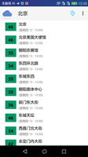

## BlueDreamAQI

梦之蓝AQI，一款旨在技术研究与学习,预报pm25等空气质量指数预报的Android版App。

#### 开发环境

- JDK1.8
- Android SDK
- AndroidStudio 3.0+

#### App截图[下载Sample](https://raw.githubusercontent.com/zhiwei1990/BlueDreamAQI/master/release/aqi.apk)

#### 开发计划

- [x] 基础功能实现，App升级、简单分享

- [ ] 数据精确完善，App设置&反馈，体验&性能提升
- [ ] Animation、Splash、Theme、Font
- [ ] 接入pm25.in数据源，提供不同的UI风格
- [ ] AQI预报、温馨（语音）提示、推送、社交化分享
- [ ] 优化&新技术的引入，NDK、Kotlin等。

#### 开源库的引用

- ButterKnife
- Okhttp3、Retrofit2
- Gson
- RxJava2、RxAndroid
- LeakCannary
- Jsoup
- UtilCode

目前项目中使用了以上开源库，在此表示感谢！

#### 贡献支持

> 获取我们都只是个开发技术小白，但是我们坚持学习前进，欢迎各位朋友fork、star本项目，让我们一同学习，一同进步！

**License:**[LGPL](./LICENSE,"开源协议")

> The Blue Dream AQI software suite is licensed under the terms of the Apache license.
>
> See [LGPL](./LICENSE,"开源协议") for more information.