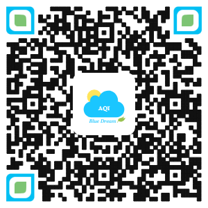
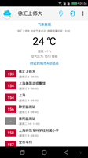
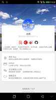
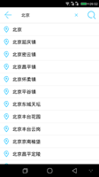

## BlueDreamAQI:partly_sunny:

      

#### 一、项目简介[^1]

> 梦之蓝AQI，旨在项目实践来学习和应用`Android`应用开发的较新技术,网络爬取`AQI`数据，以清爽的界面风格呈现于用户，以期有助于大家关注`空气质量`，关爱自身`呼吸健康`。

- ###### 为什么作此项目？

  记忆中，小时候的`大雾弥漫`是一种曼妙的意境。那时候，似乎并没有`雾霾`这么个概念。长大后，听得多的是`沙尘暴`，再后来才是`雾霾`。直到后来到北方工作后，才切身体会到，什么是`雾霾`，自身体质敏感而过敏、呼吸系统感染，不得已又返回南方工作，方才好转。

  南方也有雾霾，却很少见有人注重防护，**如果你不走进医院，你不会感受到呼吸道疾病的多么普遍，如果你不去看一些调研，你不会知道这些年空气污染引起的疾病与死亡增长了多少。[pm2.5危害](http://www.pm25.com/news/429.html)**，似乎全世界的经济发展都无法避免污染，同时我们也在治理。我们坚信生态环境会越来越好，同时我们也希望，在此之前，每个人都能爱护、保护好自己的身体健康。

​	梦之蓝AQI，项目开源数据公开，希望会对于同样空气污染敏感的朋友，有那么点参考意义，帮助我们做好呼吸防护。

- ###### 项目意义

  1. 本项目开源，旨在练习Android应用开发技术，并希望对于有需要的朋友，提供一丝参考价值
  2. 项目练习Kotlin、MVP、Jetpack、Dagger2、RxJava、Retrofit/Okhttp等热门android技术框架的应用
  3. 实践练习Android的自定义控件、动画、转场交互以及MaterialDesign设计交互等
  4. 尝试组件化的封装与设计

#### 二、体验下载[Apk](https://raw.githubusercontent.com/zhiwei1990/BlueDreamAQI/master/release/aqi.apk)

`手机扫码下载`

#### 三、App截图

#### 四、开发计划

- [x] ~~基础功能实现，App升级、简单分享~~
- [x] ~~Splash、widget、aqi地图、城市选择、 转场动画~~
- [ ] ~~热修复接入，反馈~~，设置，前台进程、X5Client，网络电量等状态响应
- [ ] pm25.com ，加入aqi资讯 吸入/沉淀量检测，生活指南/指数，作为2.0 beta版开发
- [ ] 接入pm25.in数据源，Air Visual 数据源,提供不同的UI风格
- [ ] 排行榜（每日、周、月），地图模式
- [ ] AQI预报、温馨（语音）提示、推送、社交化分享
- [ ] 配置pm2.5科普资料展示页面、防护装备、户外提示、饮食搭配等
- [ ] 优化&新技术的引入，NDK、Kotlin、flutter框架实现
- [ ] 模拟一些android的安全防护配置
- [ ] 自建python服务器，提供api，以及用户账户，上传每日城市图片

#### 五、开源库的引用

-  [butterknife](https://github.com/JakeWharton/butterknife)
- [okhttp3](https://github.com/square/okhttp)
- [retrofit2](https://github.com/square/retrofit)
- [gson](https://github.com/google/gson)
- [RxJava2](https://github.com/ReactiveX/RxJava)
- [RxAndroid](https://github.com/ReactiveX/RxAndroid)
- [leakcanary](https://github.com/square/leakcanary)
- [jsoup](https://github.com/jhy/jsoup)
- [Android UtilCode](https://github.com/Blankj/AndroidUtilCode)
- [lottie-android](https://github.com/airbnb/lottie-android)
- [TinyPinyin](https://github.com/promeG/TinyPinyin)

目前项目中使用了以上开源库，在此表示感谢！

####  六、关于作者 

> 作者本人只是一个，就职于某`知名`(@_@ 有名字的)互联网公司的，技术小白一枚，对于编程有着某种兴趣和热爱，然技术确实渣渣，好读书、不求甚解~~

`人之为学有难易乎、为之，则难者亦易矣；不为，则易者亦难矣。`

#### 七、关注及反馈

> 由于个人才疏学浅，技能有限，App的开发与设计中难免有许多问题，恳请各位朋友，不吝赐教，可以提交`issues`反馈`Bug`、`建议`或`意见`。
>
> 如若感觉项目有那么点意义和价值，可以给个`star`:smile:

[^1]: 项目开发环境为AndroidStudio `3.2.1`、Jdk8+、Windows10

