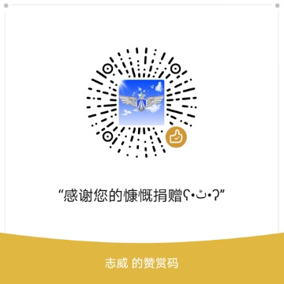

## BlueDreamAQI:partly_sunny:

[](https://developer.android.com/jetpack/) [](./LICENSE) 
[](https://android-arsenal.com/api?level=21) [](https://travis-ci.org/zhiwei1990/BlueDreamAQI) [](https://sonarcloud.io/dashboard?id=zhiwei1990_BlueDreamAQI) [](https://codebeat.co/projects/github-com-zhiwei1990-BlueDreamAQI-master)   [](https://github.com/zhiwei1990/BlueDreamAQI/releases)   [](http://hits.dwyl.io/zhiwei1990/BlueDreamAQI)


目录
=================

* [<g-emoji class="g-emoji" alias="fire" fallback-src="https://github.githubassets.com/images/icons/emoji/unicode/1f525.png">🔥</g-emoji>BlueDreamAQI]()
	* [一、项目简介]()
	* [二、更新日志]()
	* [三、Sample示例]()
	* [四、项目组成[^1]]()
	* [五、规划]()
	* [六、示例内容(部分）]()
	* [七、关于作者]()[](https://www.jianshu.com/u/72294e6848c0)[](https://github.com/zhiwei1990)[](https://blog.csdn.net/zhiwei9001)

####  一、项目简介

> 2020注定是不平凡的一年，我们在这样的艰辛与苦难中走来，春末夏初，愿一切都恢复美好。

梦之蓝AQI，旨在项目实践来学习和应用`Android`应用开发的较新技术,网络爬取`AQI`数据，以清爽的界面风格呈现于用户，以期有助于大家关注`空气质量`，关爱自身`呼吸健康`。

- ######为什么做此项目？

  记忆中，小时候的`大雾弥漫`是一种曼妙的意境。那时候，似乎并没有`雾霾`这么个概念。长大后，听得多的是`沙尘暴`，再后来才是`雾霾`。直到后来到北方工作后，才切身体会到，什么是`雾霾`，自身体质敏感而过敏、呼吸系统感染，不得已又返回南方工作，方才好转。

  南方也有雾霾，却很少见有人注重防护，**如果你不走进医院，你不会感受到呼吸道疾病的多么普遍，如果你不去看一些调研，你不会知道这些年空气污染引起的疾病与死亡增长了多少。[pm2.5危害](http://www.pm25.com/news/429.html)**，似乎全世界的经济发展都无法避免污染，同时我们也在治理。我们坚信生态环境会越来越好，同时我们也希望，在此之前，每个人都能爱护、保护好自己的身体健康。

- ######项目意义

  1. 项目综合练习`Kotlin、MVVM、Jetpack、Coroutines、Retrofit/Okhttp`等热门`android`主流技术框架的应用，并实践`APP`基础架构能力
  2. 实践练习`Android`的自定义控件、动画、转场交互以及`MaterialDesign`设计交互等

- 免责声明

<font color=green>本项目旨在研究学习`Android`相关开发技术，数据源自网络爬取（若有不当侵犯，请及时联系作者），作者及项目不对数据可靠性以及使用者的任何使用不良后果负责。使用本项目及附生产品（包括但不限于App）均表示接受本声明。</font>

#### 二、更新日志

- 2.0.0(2020年04月25日)
  - 使用最新`Jetpack`组件开发
  - 应用`KtBooster`基础库
  - 整个项目单个`Activity`配合`Fragment`实现
  - 全新的`UI`设计

- 2.0.0-alpha01(2019年11月28日)
  - 更新`jetpack`组件版本
  - `kotlin`进阶语法的基本学习
  - 简单的初步分模块

- v1.1.0（2019年6月27日）
  - 更新`AndroidStudio`以及`Gradle`编译版本
  - 更新`jetpack`及`kotlin`版本为当前最新
  - 压缩存档，以备模块化版本
  - `kotlin`初级语法的基础博文
- v1.0.0（2018年11月14日）
  - 实现`jetpack`组件的初级基础用法的演示
  - `dagger2`的基础用法演示
  - `kotlin`初级语法的整理注释
  - `databinding`的基础用法
  - `AAC`的初级使用

#### 三、Sample示例

empty now

#### 四、项目组成[^1]

项目主要综合当前最新`Android`开发技术，`Kotlin`、协程`coroutines`、`JetPack`等组件使用。

- `Android Architecture Components`
- `Kotlin、Coroutines`
- **Jetpack**
  - `lifecycle`
  - `livedata`
  - `databinding`
  - `navigation`
  - `paging`
  - `room`
  - `workmanager`

#### 五、规划

- [ ] 新版本`UI`基础优化，分享、升级、免责声明、支持跳转
- [ ] Splash、widget、aqi地图、城市选择、 转场动画
- [ ] 热修复接入，反馈，设置，网络状态响应
- [ ] 排行榜（每日、周、月），地图模式
- [ ] AQI预报、温馨（语音）提示、推送、社交化分享
- [ ] 配置pm2.5科普资料展示页面、防护装备、户外提示、饮食搭配等
- [ ] 优化&新技术的引入，NDK、Kotlin、flutter框架实现
- [ ] 模拟一些android的安全防护配置
- [ ] 自建python服务器，提供api，以及用户账户，上传每日城市图片

#### 六、示例内容(部分）

empty now

#### 七、关于作者 [](https://www.jianshu.com/u/72294e6848c0)[](https://github.com/zhiwei1990)[](https://blog.csdn.net/zhiwei9001)

> 作者本人只是一个，就职于某`知名`(@_@ 有名字的)互联网公司的，技术小白一枚，对于编程有着某种兴趣和热爱，然技术确实渣渣，好读书、不求甚解~~

`人之为学有难易乎、为之，则难者亦易矣；不为，则易者亦难矣。`

倘若本项目对你有一丝丝的帮助和价值，烦请给个`star`,或者有什么好的建议或意见，也可以发个`issues`，谢谢！:happy:

- **Donations**

  > 测试一下`Github`爱心💗**sponsor**功能,说不定您心血来潮了呢😂

  

[](https://github.com/zhiwei1990/BlueDreamAQI)[](https://github.com/zhiwei1990/BlueDreamAQI)[](https://github.com/zhiwei1990/BlueDreamAQI)

- **License**[↑回到顶部](#top)

```markdown
Copyright 2020 zhiwei.org

Licensed under the Apache License, Version 2.0 (the "License");
you may not use this file except in compliance with the License.
You may obtain a copy of the License at

	http://www.apache.org/licenses/LICENSE-2.0

Unless required by applicable law or agreed to in writing, software
distributed under the License is distributed on an "AS IS" BASIS,
WITHOUT WARRANTIES OR CONDITIONS OF ANY KIND, either express or implied.
See the License for the specific language governing permissions and
limitations under the License.
```


[^1]: 项目当前`(2020/04/25)`开发环境为AndroidStudio `3.6.3`、`gradle 6.3`、`Jdk8`、`Kotlin 1.3.72`